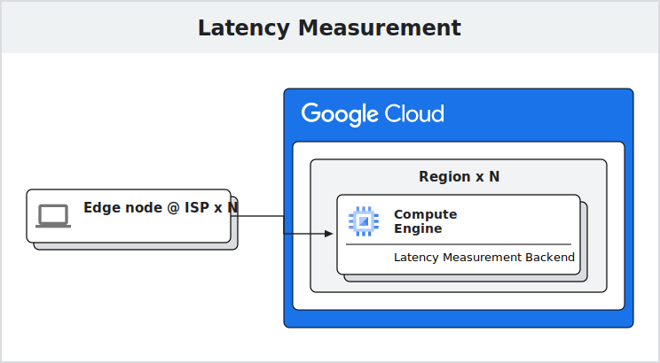
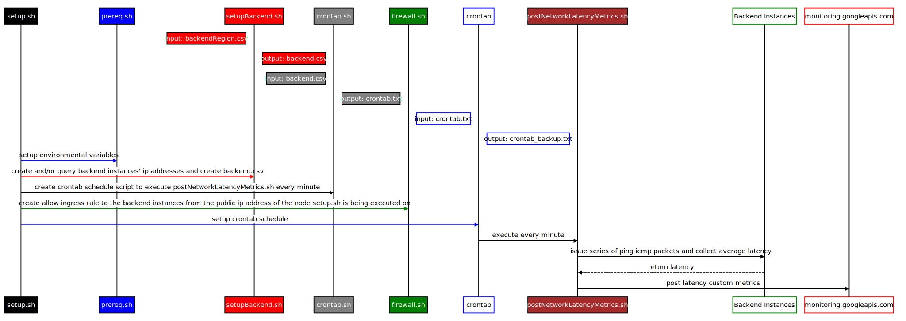

# Shell script for uploading network latency custom metrics to Cloud Operations Suite

## Disclaimer

1. Use at your own risk, no warranties are provided. Refer to the [License Summary](#license-summary) section.
2. This solution will not be supported by Google Cloud.
3. Proper testing should be done before running this tool in production.

## License Summary

This sample code is made available under Apache 2 license. See the LICENSE file.

## GCP Costs

1. Google Cloud Observability Pricing  
(Free for the first 150 MiB per billing account https://cloud.google.com/stackdriver/pricing#google-cloud-observability-pricing, https://cloud.google.com/stackdriver/pricing#monitoring-costs)

1. Backend e2-micro instance(s) cost.
   *1 e2-micro is eligible under [free usage limit](https://cloud.google.com/free/docs/gcp-free-tier).  
   (https://cloud.google.com/compute/vm-instance-pricing#e2_sharedcore_machine_type)

## Prerequisites

* Either Debian or Mac env required.

1. Setup GCP SDK - <https://cloud.google.com/sdk>

1. Initialize the SDK for the target account

   `gcloud init`  
   `gcloud auth application-default login`  
   <https://cloud.google.com/docs/authentication/gcloud#gcloud-credentials>

1. Replace ISP and Project ID in prereq.sh and run.

   `bash prereq.sh`

   This will set env variables.

1. *Optional: Disable [Restrict external IP addresses to specific VMs](https://cloud.google.com/compute/docs/ip-addresses/configure-static-external-ip-address#disableexternalip) constraint if it is defined in the [Organization Policy](https://cloud.google.com/resource-manager/docs/organization-policy/overview) if you want to test the script on GCE.

   `gcloud resource-manager org-policies set-policy disable_vmExternalIpAccess.json --project=$PROJECT_ID`

1. Modify backendRegion.csv to list the regions/zones you wish to measure latency.

1. Requires preconfigured [VPC Network](https://cloud.google.com/vpc/docs/vpc) and [Subnet for each of the Regions](https://cloud.google.com/vpc/docs/vpc#subnet-ranges) defined in the backendRegion.csv.

1. Requires the [Cloud Monitoring API](https://cloud.google.com/monitoring/api/v3) to be enabled. 

1. Requires the following IAM roles/permissions.

   At the project level: 
   1. [Compute Admin](https://cloud.google.com/iam/docs/understanding-roles#compute.admin)
   1. [Compute Network Admin](https://cloud.google.com/iam/docs/understanding-roles#compute.networkAdmin)
   1. [Logging Admin](https://cloud.google.com/iam/docs/understanding-roles#logging.admin)
   1. [Monitoring Admin](https://cloud.google.com/iam/docs/understanding-roles#monitoring.admin)
   1. [Monitoring Editor](https://cloud.google.com/iam/docs/understanding-roles#monitoring.editor)
   1. [Monitoring Viewer](https://cloud.google.com/iam/docs/understanding-roles#monitoring.viewer)

   At the organization level: 
   1. [Compute Organization Firewall Policy Admin](https://cloud.google.com/iam/docs/understanding-roles#compute.orgFirewallPolicyAdmin)
   1. *Optional: [Organizational Policy Admin](https://cloud.google.com/iam/docs/understanding-roles#orgpolicy.policyAdmin)

1. Install jq  

   Example  
   `sudo apt-get install jq`  
   or  
   `brew install jq`

1. Install dig

   Example  
   `sudo apt-get install dnsutils`

1. Mac Only

* Add full disk access for cron program  
  <https://phoenixnap.com/kb/bash-redirect-stderr-to-stdout>
* Turn off power nap  
  <https://support.apple.com/en-ca/guide/mac-help/mh40774/mac>
* *Might be requried on older MacOS versions: Remove quarantine flag from postNetworkLatencyMetrics.sh  
   `sudo xattr -d com.apple.quarantine ./postNetworkLatencyMetrics.sh`  

## Setup Latency Collection Schedule

1. Replace Backend Region and Zone in backendRegion.csv.

1. Run setup.sh to create backend instances and setup crontab schedules.

    `bash setup.sh`

   This will setup 2 e2-micro instances per region defined in backendRegion.csv, one for premium and standard network each. It'll then setup crontab schedule to execute every minute that'll collect latency custom metrics to the backend instances. It'll also find out the current machine's public ip address and create a firewall rule that allows icmp to ingress into backend instances. Note that it'll only create backend instances when it can't find any.

## Clean up instructions

1. Run deleteBackend.sh to delete backend instances and ingresss firewall rules.

    `bash deleteBackend.sh`

   This will delete premium and standard network backend e2-micro instances in the regions defined in backendRegion.csv and also delete ingress firewall rules.

2. Run deleteMetrics.sh to delete the custom metrics.

    `bash deleteMetrics.sh backendRegion.csv`

   Note that all the accumulated latency custom metrics will be deleted, proceed with caution.
